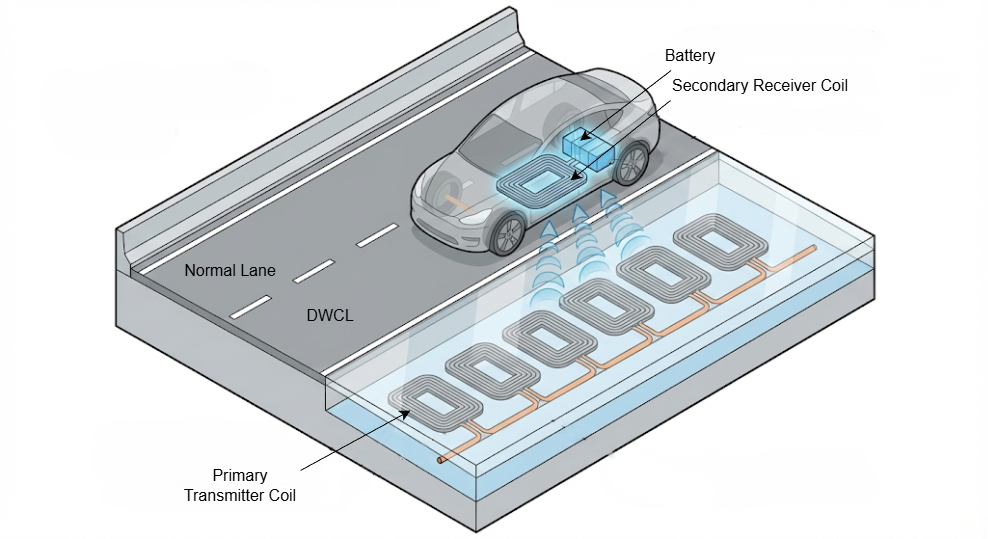
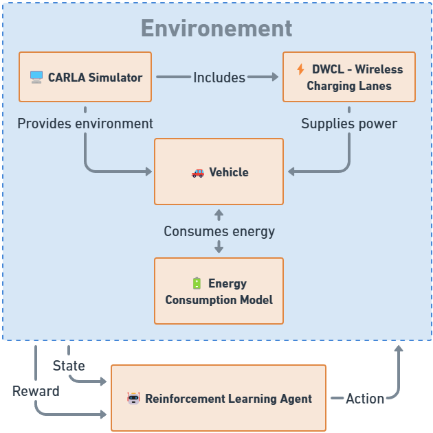
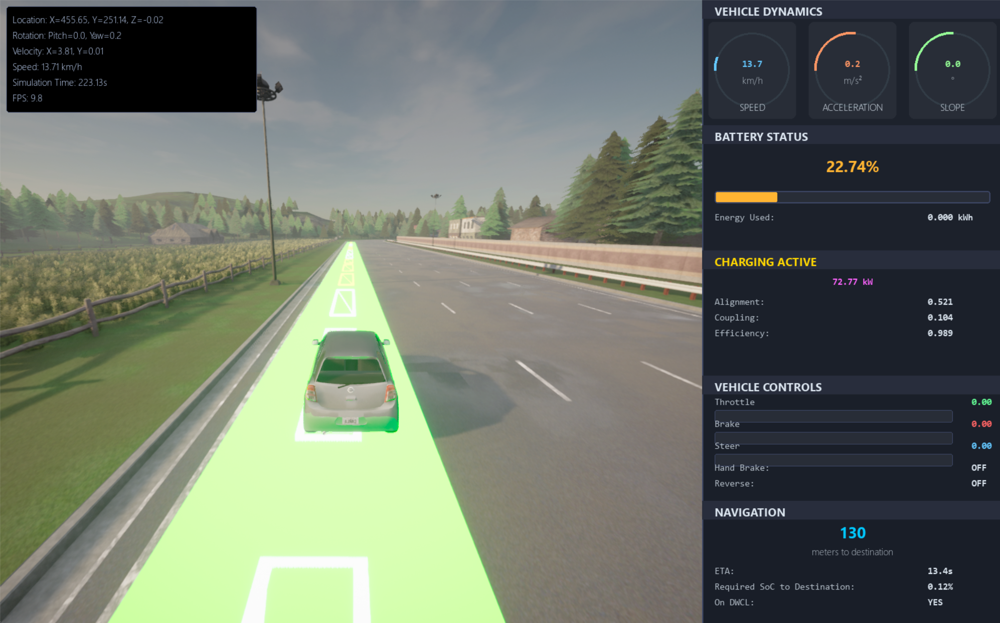

# 🔋 DWCL-RL: Reinforcement Learning for Dynamic Wireless Charging Lanes in CARLA

## 📖 Overview

This repository contains the **official research code** for the paper:


> *Ahmed-Ramzi Houalef, Florian Delavernhe, Sidi-Mohamed Senouci, El-Hassane Aglzim. "Optimal Control of Electric Vehicles in Dynamic Wireless Charging Lanes Using Deep Q-Networks." 2025 IEEE 102th Vehicular Technology Conference (VTC2025-Fall).*  
> [🔗 DOI: 10.1109/VTC2025-Fall65116.2025.11310467](https://hal.science/hal-05094364v1)

> **📌 Important:** The research code used for the paper is the Jupyter notebook. Other files are refactored versions.

This work addresses **energy-aware optimal control of electric vehicles (EVs)** operating on **Dynamic Wireless Charging Lanes (DWCL)** using **Deep Reinforcement Learning (DQN)** in the **CARLA high-fidelity simulator**.

> **📚 Energy Model for the EV:** Based on our previous work:  
> *Ahmed-Ramzi Houalef, Florian Delavernhe, Sidi-Mohamed Senouci, El-Hassane Aglzim. "Utilizing Data-Driven Techniques to Improve Predictive Modeling of Connected Electric Vehicle Energy Consumption." 2024 IEEE 100th Vehicular Technology Conference (VTC2024-Fall).*  
> [🔗 DOI: 10.1109/VTC2024-Fall63153.2024.10757738](https://hal.science/hal-04949806v1)

**Objective:** Learn *when* an EV should:
- ⚡ Enter or exit a DWCL
- 🎯 Adapt speed while charging
- ⏱️ Balance energy constraints & travel time
- 🛣️ Maintain lane-switching stability

*Without relying on handcrafted rules.*

---

## 🎬 Demonstration

**Full environment demonstration in CARLA** including DWCL entry/exit manoeuvres, charging behavior, energy-aware decisions, and regenerative braking:

<p align="center">
  
</p>

<p align="center"><em>Figure: Real-time control decisions during DWCL operation</em></p>

---

> **📌 Important Notes**
> 
> **CARLA Release:**  `0.9.15`
>
> **Python version:** `3.7.16`
> 
> **Edit CARLA instation path in:** `src/carla_simulator/behavior_agent.py and src/carla_simulator/carla_env.py`
> 
> **To run a play window:** `scripts/play_dwcl.py`.
> 
> **To train:** `scripts/train.py`.


---

## 🏗️ System Architecture

### Dynamic Wireless Charging Lane (DWCL) Concept

DWCL technology enables EVs to recharge **while driving**, eliminating static charging stops and range anxiety.

<p align="center">
  
</p>
<p align="center"><em>Figure 1: Dynamic Wireless Charging Lane (DWCL) infrastructure</em></p>

### Control Framework

<p align="center">
  
</p>
<p align="center"><em>Figure 2: Integrated DQN-CARLA-DWCL control architecture</em></p>

---

## 🤖 Reinforcement Learning Formulation

### 🧠 State Space
| State Variable | Description | 
|----------------|-------------|
| `SoC` | Current battery state of charge |
| `SoC_required` | Minimum SoC to reach destination |
| `ETA` | Estimated time of arrival (seconds) |
| `remaining_distance` | Euclidean distance to destination (meters) |
| `lane_type` | Current lane type (0=normal, 1=DWCL) |
| `target_speed` | Current cruising speed (km/h) |

### 🎮 Action Space
| Action ID | Action | Description |
|-----------|--------|-------------|
| 0 | 🟢 Enter DWCL | Switch to charging lane |
| 1 | 🔴 Exit DWCL | Return to normal lane |
| 2 | ⬆️ Accelerate (in DWCL) | Increase speed while charging |
| 3 | ⬇️ Decelerate (in DWCL) | Reduce speed while charging |
| 4 | ⏸️ Maintain (in DWCL) | Keep current speed |
| 5 | 🚗 Stay Outside | Continue with Traffic Manager |


---

## 🚗 CARLA Simulation Environment

<p align="center">
  
</p>
<p align="center"><em>Figure 3: CARLA simulation with integrated DWCL infrastructure</em></p>

**Environment Features:**
- 🎯 Realistic vehicle dynamics (CARLA physics engine)
- ⚡ DWCL coil placement & electromagnetic simulation
- 🚦 Traffic Manager integration for realistic traffic
- 🔄 Regenerative braking modeling
- 📊 Real-time energy consumption tracking

---

## 📚 Citation

If you use this code or build upon this work, please cite:

```bibtex
@inproceedings{houalef2025dwcl,
  title     = {Optimal Control of Electric Vehicles in Dynamic Wireless Charging Lanes Using Deep Q-Networks},
  author    = {Houalef, Ahmed-Ramzi and Delavernhe, Florian and Senouci, Sidi-Mohamed and Aglzim, El-Hassane},
  booktitle = {IEEE 102nd Vehicular Technology Conference (VTC2025-Fall)},
  year      = {2025},
  address   = {Chengdu, China},
  publisher = {IEEE},
  doi       = {10.1109/VTC2025-Fall65116.2025.11310467},
  hal_id    = {hal-05094364}
}
